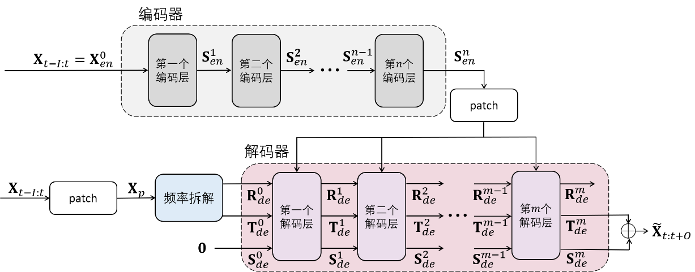
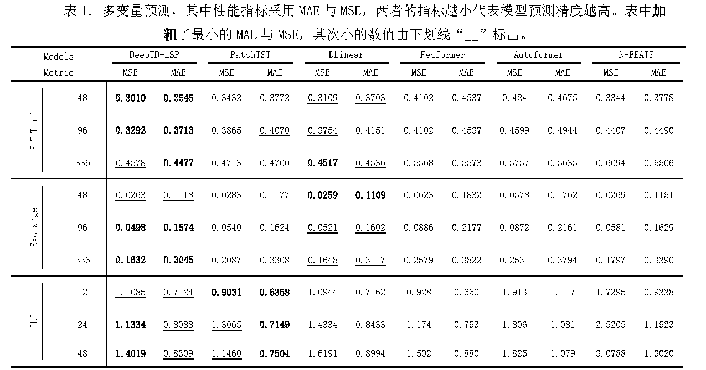

# DeepTD-LSP

> DeepTD-LSP (Deep Temporal Decomposition Long-term Series Prediction) model is constructed based on an encoder-decoder structure and combined with an attention mechanism. It uses the frequency disassembly module for series disassembly, and splits the series into trend information, seasonal information and noise. The model is tested on three real-world datasets, and the experimental results show that the DeepTD-LSP model outperforms the other five new long-term time series prediction models.

​                                                        

## Frequency Disassembly

Figure1.DeepTD-LSP

## Main Results

## Get Started

1. Install Python >=3.6,PyTorch 1.9.0.
2. Download data. You can obtain all the six benchmarks from [[Autoformer](https://github.com/thuml/Autoformer)] or [[Informer](https://github.com/zhouhaoyi/Informer2020)].
3. Train the model. We provide the experiment scripts of all benchmarks under the folder `./scripts`. You can reproduce the multivariate and univariate experiment results by running the following shell code separately: